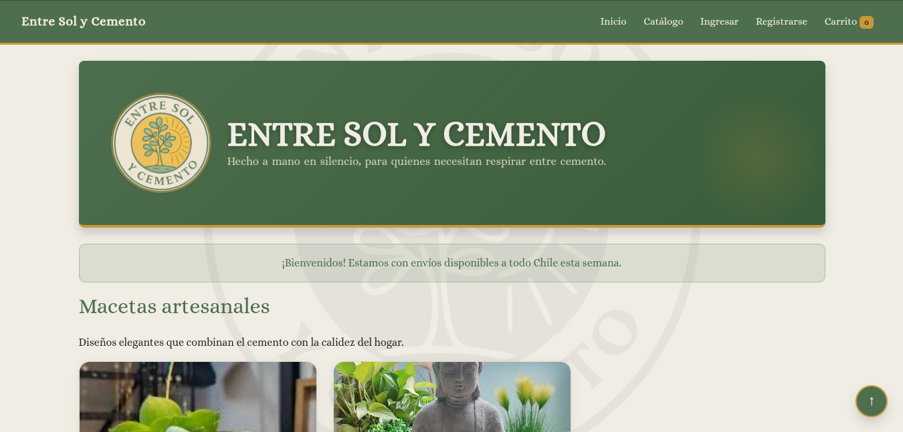
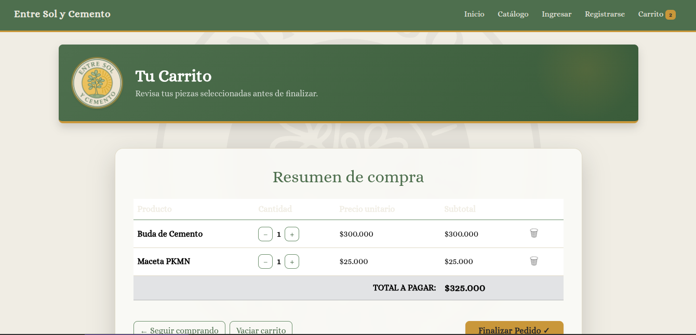

# 🌿 Entre Sol y Cemento — E-commerce Frontend

**Entre Sol y Cemento** es un frontend de comercio electrónico creado para un emprendimiento real, ofreciendo una experiencia de compra intuitiva, carrito dinámico con persistencia de datos y diseño responsivo adaptable a cualquier dispositivo. Este proyecto sirve como base para integrar un backend robusto y un sistema completo de e-commerce.

## 🔗 Repositorio GitHub

> **[hhttps://github.com/alexzamorano/entresolycemento-ecommerce-frontend](https://github.com/alexzamorano/entresolycemento-ecommerce-frontend)**

## 📖 Tabla de Contenidos
- 🚀 Funcionalidades
- 🛠 Tecnologías Utilizadas
- 📁 Estructura del Proyecto
- 📸 Preview
- 🧠 Aprendizajes Clave
- 📌 Próximos Pasos
- 👤 Autor

## 🚀 Funcionalidades

- Catálogo interactivo: Muestra productos con imagen, nombre y precio.
- Carrito dinámico: Permite agregar, eliminar y modificar cantidades de productos en tiempo real, con actualización automática de totales.
- Persistencia de datos: El carrito se mantiene aunque la página se recargue mediante localStorage.
- Diseño responsivo: Compatible con móviles, tablets y desktop.

## 🛠 Tecnologías Utilizadas

- HTML5: Estructura semántica.
- CSS3: Estilos personalizados y layouts con Flexbox/Grid.
- JavaScript (ES6+): Lógica de negocio, manipulación del DOM y control de interacciones.
- jQuery: Optimización de eventos y animaciones simples.
Se utilizó jQuery de forma complementaria para agilizar ciertas interacciones, aunque la lógica principal está en JavaScript moderno.

## 📁 Estructura del Proyecto
.  
├── assets/      - Imágenes y recursos estáticos  
├── css/         - Hojas de estilo  
├── js/          - Lógica del carrito y funciones principales  
├── index.html   - Página principal  
└── README.md    - Documentación  

## 📸 Preview

### Vista Principal (Home)

### Gestión del Carrito

## 🧠 Aprendizajes Clave

- Implementación de lógica CRUD en el frontend  
- Manejo de almacenamiento local (localStorage) para mejorar UX  
- Integración de librerías externas (jQuery) con JavaScript nativo  
- Control de versiones y manejo de repositorios en Git/GitHub  
- Organización de proyecto y documentación profesional

## 📌 Próximos Pasos
- [ ] Integración de backend con Python/Django  
- [ ] Implementación de base de datos relacional  
- [ ] Sistema de autenticación de usuarios  
- [ ] Mejoras en UI/UX y accesibilidad

## 👤 Autor
**Alex Zamorano**  
- Laboratorio clínico | Desarrollador Fullstack Python en formación  
- LinkedIn: [https://www.linkedin.com/in/alex-zamorano](https://www.linkedin.com/in/alex-zamorano)  
